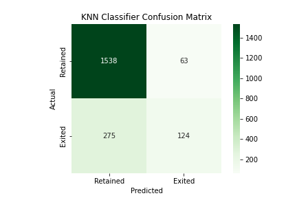
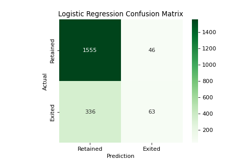
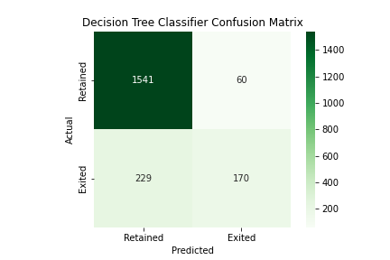

## Banking Churn Classification Analysis

The purpose of this project is to create a classification model that will predict whether a bank customer will churn. The aim of this project is to increase precision as much as possible through the trial of many different classification models. With high precision we will be minimizing false positives and be increasing the certainty that our positives are actually people that will churn. This will allow for better utilization of limited customer service resources to directly reach out to potential churning customers. 

